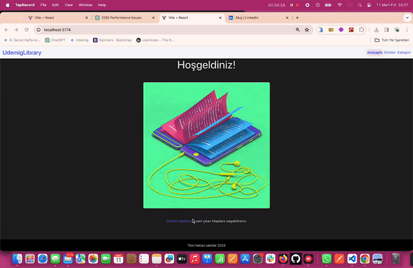

<h1> RRD_UdemigLibrary </h1>

This project encompasses a simple book application created using React and React Router. The project serves as an example of utilizing React Router for navigation between different pages, listing products and accessing their details. It also handles scenarios such as a 404 error. The aim is to demonstrate the usage of React Router in managing navigation and handling various states within a React application.

<h2> The technologies used in the project </h2>

<ul>
<li>React: A JavaScript library used for creating user interfaces</li>
<li>React Router: A router library used for navigation and routing between pages</li>
</ul>

<h2> Screenshot </h2>

# RR_UdemigLibrary
# RR_UdemigLibrary
